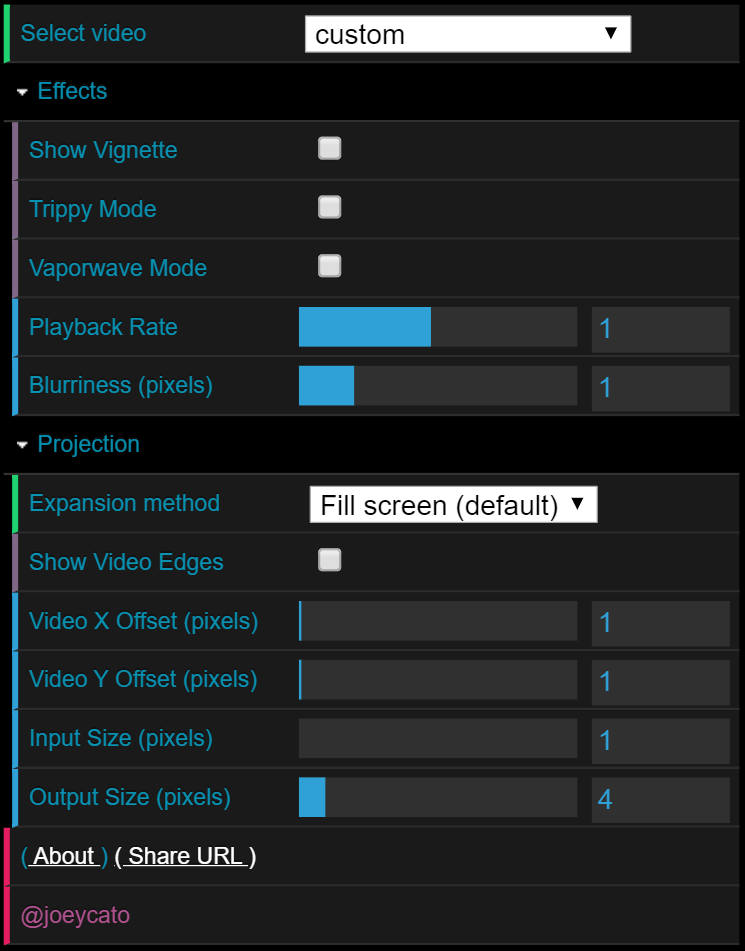
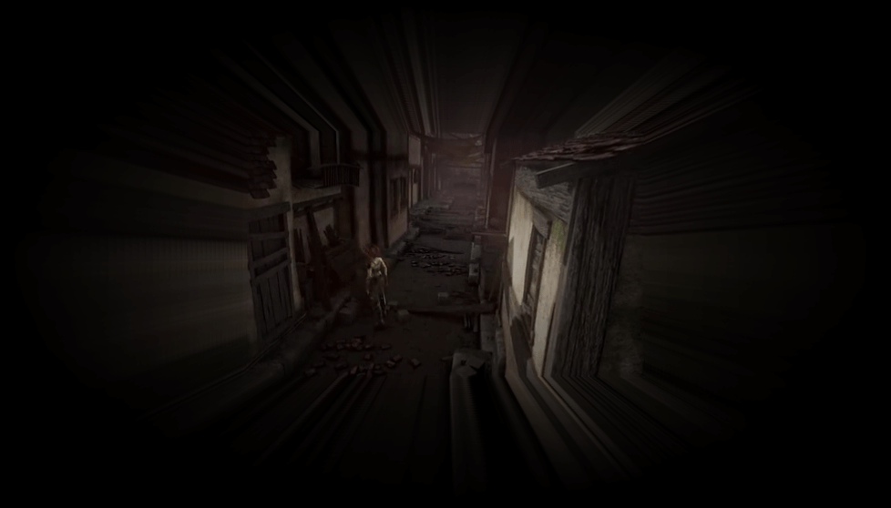
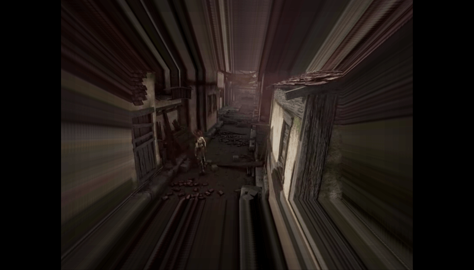
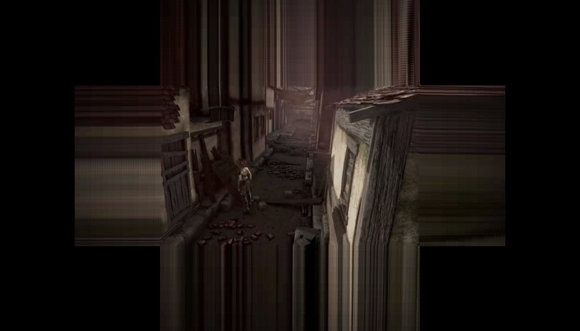
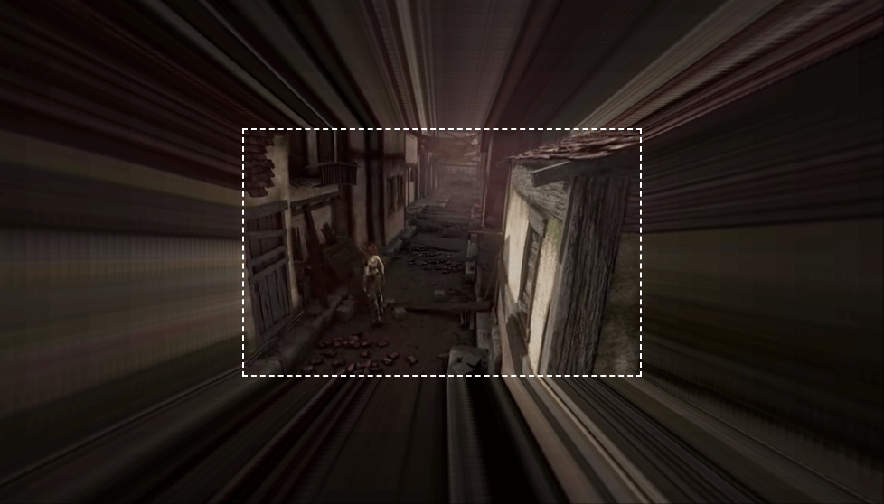
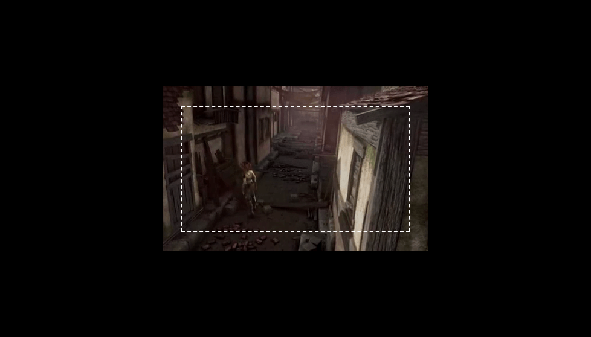
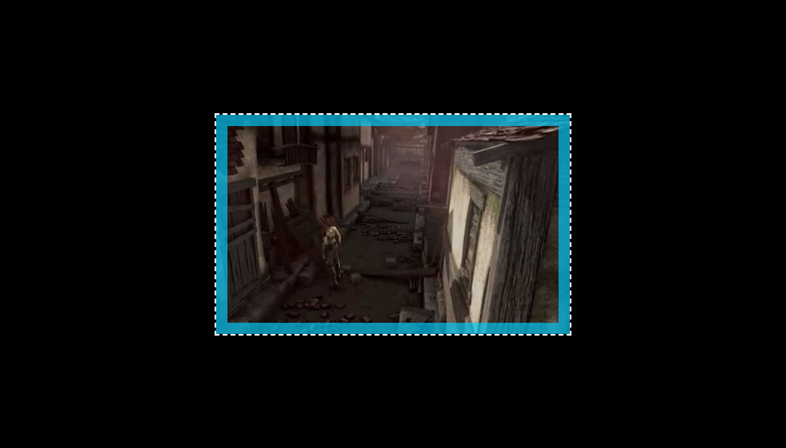

# So what is this thing?

The **boundless video player** is an experimental web app that continuously
resamples a video's edge pixels during playback and projects them outwards in
3D, in effect removing that video's traditional boundaries. I originally created
this app to rekindle the nostalgia of classic 80's music videos, but in the
process of making it discovered it's fun to try on just about any type of video.

This app _should_ work on most devices, though be aware I primarily developed
this on desktop (Chrome browser) and tested on iPhone/iPad devices. For the best
viewing experience, a large display is recommended. FWIW it runs great on an
Ultra Widescreen monitor 😀

Click here to access the app: https://bvp.surge.sh/

# Known issues 🐜

-   iOS Chrome browser in landscape mode: Zoom toggles on unexpectedly causing
    misalignment ( please use Safari browser instead )

# Settings

To get the most out of this app, try playing around with the following settings
in realtime. ( Note: The URL is automatically updated to reflect your changes,
which can be shared out to others )

## **Select video**

A drop-down menu to choose between the available video samples. _Each demo is
configured with custom presets, but you can override them after the video is
loaded._  📺You can also load your own custom videos by adding the
following URL parameter: `?v=<PATH_TO_YOUR_CUSTOM_VIDEO_URL>` For best
results, use a non-DRM HTML5 video stream close in size to 640x360 or 480x360. You can
also optionally specify a starting timestamp with `#t=<SECONDS>`

## **Effects**

Additional effects you can apply to improve the visualization

-   **Show Vignette** - Whether to apply a shadowy radial gradient on the main
    view  _( URL param: #vig=true )_

-   **Trippy Mode** - When activated, the expanded pixels are alpha-blended
    together, creating a neat smearing effect.  _(URL
    param: #tr=true)_

-   **Vaporwave Mode** - Applies a cyan/magenta linear gradient to the
    view Tip: To more authentically maximize the
    [Vaporwave](https://en.wikipedia.org/wiki/Vaporwave) experience, try also
    adjusting the playback rate to 0.7 or lower  _(URL
    param: #vw=true)_

-   **Playback Rate** - Changes the video playback speed _( URL param: #rate=R,
    where 0.1 <= R <= 2 )_

-   **Blurriness (pixels)** - Applies a Gaussian blur on the projection, based on
    the defined pixel radius To disable the blur, set the value to 0.
    Recommended setting: 1  _( URL param: #blur=R, R =
    pixel radius )_

## **Projection**

Additional controls to fine-tune the expansion

-   **Expansion method** - The manner in which the boundary pixels of each video
    frame are expanded outwards

    -   _Fill screen_ - Pixels expand to fill the screen in a 3D perspective. (
        Default behavior )   _( URL param: #mode=0 )_

    -   _Spread evenly_: Pixels expand in a 3D perspective but equally in both
        directions This pattern is mainly useful if you wish to improve the
        horizontal/vertical pixel alignment ( it may also help improve performance
        if you're on a slow device.)  _( URL param:
        #mode=1 )_

    -   _2D_: Pixels expand only in the four cardinal
        directions.  _( URL param: #mode=2 )_

    -   _None_: No expansion pattern is applied. Choose this mode if you just
        want to see the main video  _( URL param:
        #mode=3 )_

-   **Show Video Edges** - Draws a white rectangle around the source region of the
    original video frame.  _( URL param:
    #border=true )_

-   **Video X/Y Offset (pixels)** - Sets the horizontal/vertical offsets of the
    cropped video from which the projection is based Tip: Use this setting to
    eliminate projection gaps ( by moving offsets beyond pillarboxed regions and
    unwanted borders. )  _( URL param:
    #xOff=X&yOff=Y, X/Y = pixel offsets )_

-   **Input Size (pixels)**: Sets the # of edge pixels to sample from the source
    video frame Tip: Set both input and output slices to a similar larger value
    if you want the projection to be more blocky.  _(
    URL param: #in=R, R = pixel radius )_

-   **Output Size (pixels)**: Sets the scaled pixel size of where the sampled edge
    pixels are redrawn. Tip: Set this to a higher value if you want to increase
    the projection speed  _( URL param: #out=R, R =
    pixel radius )_

-   **About**: Opens up this document
-   **Share URL**: Generates a URL which reflects the video selection and settings and opens a Twitter dialog for sharing.

# Basic Controls

While the basic menu should give you direct access to playback and settings, the
following keyboard shortcuts are also available for more convenience

|            **Input**            | **Action**                                                                                |
| :-----------------------------: | ----------------------------------------------------------------------------------------- |
| Space ( or Click in window ) | Toggles both menu and video playback                                                      |
|              Enter              | Toggles settings                                                                          |
|             Escape              | Toggles video playback ( useful if you want to pause the screen to take a screenshot ) |

 Have fun!  [@joeycato](https://twitter.com/joeycato)
